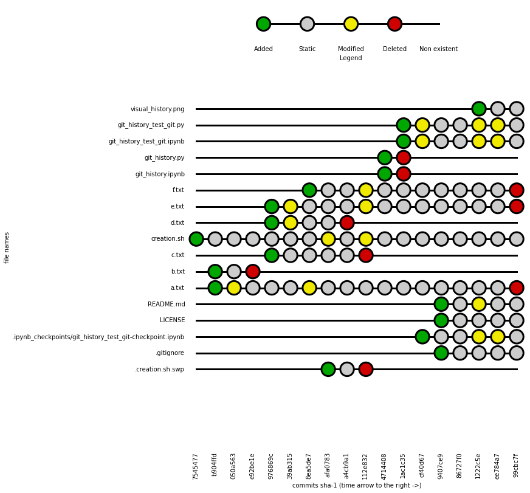
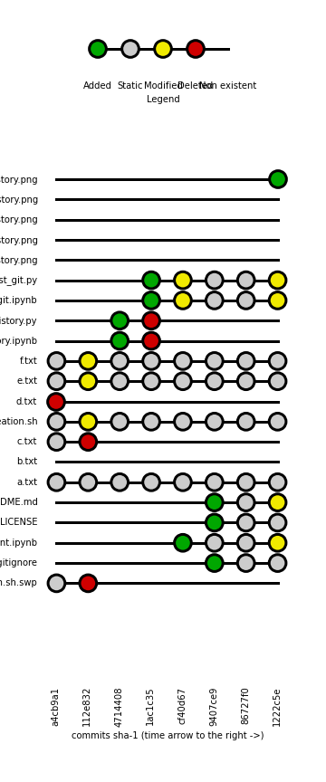
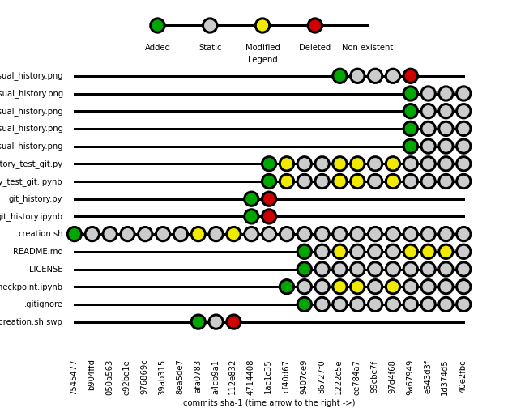
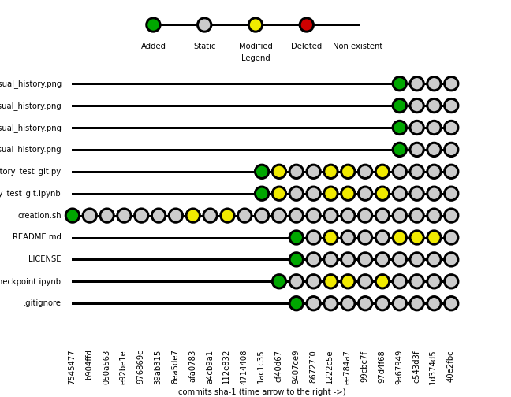

# Git history visualizer

[](https://gitter.im/kidpixo/git_history_visualizer?utm_source=badge&utm_medium=badge&utm_campaign=pr-badge&utm_content=badge)

This script solve this problem:

*I want to visualize the history of all the files in a git repository [in one branch]*

The idea is to extract the whole commits log via the `git` command (you should have it on your machine) and process it to have:

- the list of all files that ever existed in this branch
- the list of all commits (at this stage we use the short SHA-1 hash)

# Examples

The notebook and the python script included in this repo,  ([git_history_test_git.ipynb](https://github.com/kidpixo/git_history_visualizer/blob/master/git_history_test_git.ipynb) and [git_history_test_git.py](https://github.com/kidpixo/git_history_visualizer/blob/master/git_history_test_git.py)) are just an example.

Replace the value of ''path'' variable at the beginning of the Python script with your repository's path and play with visualization options at the end.

This example is on this very repository, the first `*txt` files were just placeholders.

This is the complete visual history of this repository:

```python
plot_history_df(all_filenames)
```




This is a commit range, using Python Data Analysis Library ([pandas](http://pandas.pydata.org/):

```python
plot_df_commit_range = all_filenames.ix[:,'a4cb9a1':'1222c5e']
```



This is a range of files:

```python
plot_df_file_range = all_filenames[~all_filenames.index.str.contains('txt$')]
```



This combines the two filters:

```python
plot_df_commit_file_range = all_filenames.ix[:,'a4cb9a1':'1222c5e']
                            [~all_filenames.index.str.contains('txt$')]
```


This is a filter on all the file states in the last commit:

```python
plot_df_state_filter = all_filenames[all_filenames[all_filenames.columns[-1]] != 'N']
```


